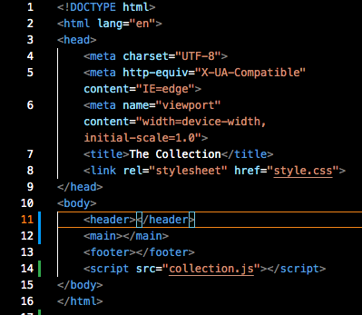

# The Collection

## First Step

At first, I created this page only using html and css to have a global vision.

## Second Step
Then, I went over my JS file, where I created the tags, classes and text. The method is to follow my html file and create the elements one by one. When the JS file was finished, I deleted everything in the html file to leave only the "header", "main" and "footer"

The page is responsive, which makes it easy to visit the page on any screen.

on a phone :

on a normal screen :

on a big screen :

The goal of this exercise was to put into practice all the information assimilated for 3 weeks.